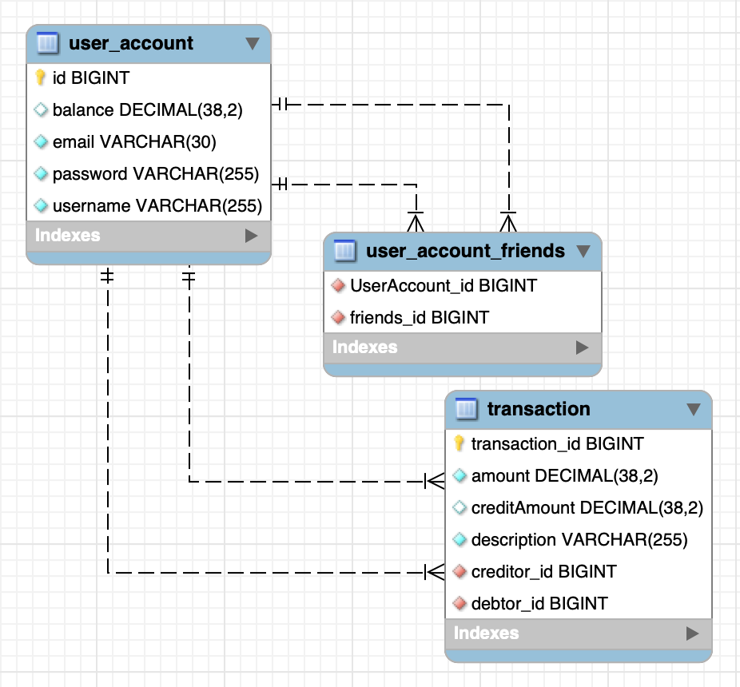

# PayMyBuddy
This is an application for sending money between your friends without bank information

# Features
This application realize transaction of money between your friends only with their email address as information !
You need no more bank account information like a RIB, swift code ...etc !

# Requirement
* Java 17
* Apache Maven 3.8.7
* Spring Boot 3.0.2

# Installation
To run this application on your local machine, please follow the instructions below:
### Requirements
* Install Java:\
https://adoptium.net/temurin/releases?version=17
* Install Maven:\
https://maven.apache.org/install.html
* Install MySql:\


### Application
1) Clone the source code from GitHub or download it as a ZIP file.
```bash
git clone https://github.com/ShizukaLouisChoco/PayMyBuddy.git
```
2) Open a terminal and navigate to the root directory of the project. 
3) Use Maven to build the project by running the following command:
```bash
mvn clean install
```
This will create a JAR file that contains all the necessary dependencies.

# Usage
After database setup and tests are done, you can use this user account to log in this application.
* login : user@example.com:
* password : user\

Before running the application, make sure to perform the following steps:
### Setup database

1) set username and password in application.properties

```bash
   spring.datasource.url
   spring.datasource.username
   spring.datasource.password
```
2) Creation of the database by running the following command:
```bash
CREATE DATABASE paymybuddy;
USE paymybuddy;
```
3) Tables will be created automatically by running the application:
* transaction
* user_account
* user_account_friends

4) First Data will be inserted automatically by running the application:
* user
* user2
* user3

### Test
```bash
//clean ./target
mvn clean
//run tests
mvn test
//execute jacoco report at 
mvn verify
```
Check jacoco report (/target/site) :
* jacoco-unit-test-coverage-report\
-> report of unit test
* jacoco-integration-test-coverage-report \
-> report of integration test
* jacoco-merged-test-coverage-report \
-> report of unit test and integration test

  
Once the database is ready and the user tests have passed, you can start the application by running the following command:

```bash
java -jar transactionApp-0.0.1-SNAPSHOT
```
Once the application is running, open your web browser and navigate to http://localhost:8080.

# Model Class Diagram UML


# Database Model



# Script mySQL
```bash
drop table if exists transaction;
drop table if exists user_account;
drop table if exists user_account_friends;

create table transaction (
transaction_id bigint not null auto_increment,
amount decimal(38,2) not null,
creditAmount decimal(38,2),
description varchar(255) not null,
creditor_id bigint not null,
debtor_id bigint not null,
primary key (transaction_id));

create table user_account (
id bigint not null auto_increment,
balance decimal(38,2),
email varchar(30) not null,
password varchar(255) not null,
username varchar(255) not null,
primary key (id));

create table user_account_friends (
UserAccount_id bigint not null,
friends_id bigint not null);
```

